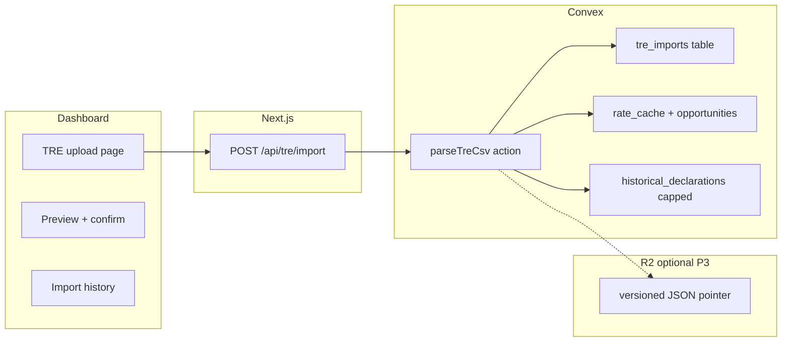

# Plan: TRE CSV import (user-facing)

**Status:** ACTIVE — Phase 1 shipped `d6b58cf` (upload UI + parser + org-scoped import) · Phase 2 feature-complete locally (opportunities engine + UI), pending deploy  
**Backlog:** [`BACKLOG.md`](./BACKLOG.md) P1 — **done 2026-06-23** (`d6b58cf`)  
**Last updated:** 2026-06-23

---

## Goal

Let customers **upload HMRC TRE CSV exports** in the app, store them safely, and **use the data** for duty estimates, HS suggestions, and savings **opportunities** — without claiming “instant reclaims” or “auto-sync from Connect HMRC.”

---

## What you already have

| Piece | Location | Status |
|--------|----------|--------|
| CSV → `historical_declarations` | `convex/ingest.ts` | PoC parser, email-only |
| Email ingest | `convex/http.ts` `/ingest-email` | Postmark + `INGEST_SECRET` |
| Rate cache rebuild | `convex/declarations.ts` `refreshRateCache` | Runs after ingest |
| HS suggest from history | `convex/analytics.ts` `suggestFromHistory` | Uses `by_user_country` |
| Reports duty fallback | `getHistoricalRateMap` / `buildRateMap` | Feeds estimates |
| Column guide | `/guides/how-to-read-cds-csv-export-tre` | Good UX copy source |

**Gap:** no dashboard UI, weak CSV parsing, **userId-only** (not org), no dedupe, no import status, and **Convex 1,000-row architecture rule** not handled for large TRE files.

---

## Product principles

1. **Manual upload** — user exports from HMRC TRE; you do not pull TRE via OAuth today.
2. **Honest outcomes** — “import history”, “duty estimates”, “possible savings flags” — not “reclaim filed.”
3. **Org-scoped** — imports belong to the **Clerk org**, shared like declarations.
4. **Convex-safe** — do not dump 50k line items into Convex; aggregate + R2 for bulk.

---

## Architecture



### Data model (new / extended)

**`tre_imports`** (new)

```
orgId, uploadedBy, filename, rowCount, lineItemsStored, status,
errors[], createdAt, completedAt, r2Key?, checksum
```

**`historical_declarations`** (extend)

- Add `orgId`, `importId`, `sourceRowHash` (dedupe)
- Index: `by_org`, `by_import`, `by_org_country`

**`rate_cache`** (extend)

- Key by `orgId` (not only `userId`) — align with org workspace

**R2** (Phase 3, if file > 1,000 rows)

- Path: `v2026-06/tre/{orgId}/{importId}.json`
- Convex stores pointer + precomputed aggregates only

---

## Phased delivery

### Phase 1 — MVP upload (1–2 weeks)

**User flow**

1. **Compliance → Import TRE data** (or Settings → Data)
2. Short copy: export steps + link to your guide
3. Drag-drop `.csv` (max e.g. 10 MB)
4. Server parses → **preview**: row count, date range, EORIs, sample 5 rows, parse warnings
5. **Confirm import** → progress → success summary
6. Show: “X line items imported · rate cache updated · Y possible preference flags”

**Backend**

| Task | Detail |
|------|--------|
| Extract parser | `src/lib/tre-csv-parser.ts` — proper CSV (quoted fields), header normalisation from guide |
| Map columns | MRN, commodity, origin, preference, duty, VAT, customs value, CPC, acceptance date |
| Auth mutation | `convex/tre_imports.ts` — `createImport`, `completeImport`, `listImports` |
| Replace ingest | `internal.ingest.processCsv` called from **authenticated** path only |
| Dedupe | `sourceRowHash = hash(mrn + line + commodity + taxType + amount)` skip duplicates per org |
| Cap | **≤ 1,000 rows** into Convex per import; reject or truncate with clear message |
| Org scope | All queries/mutations use `getActiveOrgId` + ownership |
| API route | `POST /api/tre/import` — Clerk auth, stream file, call Convex action |
| Post-import | `refreshRateCache({ orgId })`, `recomputeDashboardSummary` if needed |

**UI files**

- `src/app/dashboard/tre-import/page.tsx`
- `src/components/tre-import-upload.tsx`
- Sidebar: under Compliance → **Import TRE**

**Tests**

- Fixture CSV from guide columns
- Parser unit tests (`tests/tre/csv-parser.test.ts`)
- Dedupe + 1001-row rejection

**Do not**

- Wire homepage “connect = import history”
- Promise reclaims

---

### Phase 2 — Import history & opportunities (1 week)

**Status:** Import history table shipped in Phase 1 (`tre-import-upload.tsx` drill-down). Remaining: opportunities engine + dashboard/reports wiring.

| Feature | Detail | Status |
|---------|--------|--------|
| Import list | Table: date, file, rows, status, who uploaded | Done (Phase 1) |
| Import row drill-down | View stored line items per import (`listImportRows`) | Done (Phase 1) |
| Re-import | Same file → dedupe, show "0 new / N skipped" | Done (`sourceRowHash`) |
| Savings view | `convex/tre_analytics.ts` `listOpportunities` — deterministic MFN-vs-preference scan from `tariff_cache`, flag only | **Done** |
| Opportunities UI | `src/components/tre-opportunities.tsx` on TRE page — flagged rows + indicative delta + 3yr window + C285 signpost | **Done** |
| Dashboard | TRE opportunities merged into Potential Overpayments card (amber `~£`, indicative footnote) | **Done** |
| Reports | "Includes TRE history" badge when org has stored imports | **Done** |

#### HMRC developer-guide alignment (must follow)

Per [`FINANCIAL-ROADMAP.md`](./FINANCIAL-ROADMAP.md) §5 and `.cursorrules` §2–3:

1. **Tariff is the only authority for preference eligibility.** Opportunity detection cross-checks origin against the **Trade Tariff API** preference measures for that commodity — never a hardcoded "FTA list" guess. Reference: `convex/lib/duty_rate_parser.ts` + `tariff_cache`.
2. **Flag only, never assert recovery.** Output copy: "Possible duty review" / "Potential preference opportunity". Forbidden: "reclaim", "you are owed", "recoverable", any £ "savings" figure presented as certain.
3. **Deterministic TypeScript only.** Opportunity scoring is pure TS comparison of TRE row vs tariff measure. **No AI** in the detection path (AI may explain a flag, never generate it).
4. **C285 eligibility = signpost only.** Where an overpayment pattern appears, link the user to HMRC's repayment guidance — do not pre-fill or estimate the claim. Reference: <https://www.gov.uk/guidance/how-to-claim-a-repayment-of-import-duty-and-vat-if-youve-overpaid>.
5. **Org-scoped + audited.** `tre_analytics` queries gate on `getActiveOrgId`; opportunity views read org rows only; no trade data in logs.

#### Opportunity detection rule (deterministic)

For each imported `historical_declarations` row:

```
IF preferenceCode is empty/100 (no preference claimed)
AND tariff measure for (commodityCode, countryOfOriginCode) shows a preferential rate < MFN
THEN flag = "potential preference opportunity"
     estimatedDelta = (MFN rate − preference rate) × itemCustomsValue   // labelled "indicative only"
```

`estimatedDelta` is shown as an **indicative, non-binding** figure with the standard estimate disclaimer — never as money owed.

#### Files (Phase 2)

```
convex/tre_analytics.ts                 # opportunity scan (org-scoped, deterministic)
src/app/dashboard/tre-import/page.tsx   # add Opportunities tab/section
tests/tre/opportunities.test.ts         # rule unit tests vs tariff fixtures
```

#### Acceptance criteria (Phase 2 done)

- [x] `tre_analytics.listOpportunities` returns org-scoped flags, deterministic, no AI
- [x] Preference check uses Trade Tariff measures (not a static country list)
- [x] Unit tests cover: preference-blank + preferential origin → flag; preference-claimed → no flag; unknown commodity → no flag; unquantifiable duty → no flag (`tests/tre/opportunities.test.ts`)
- [x] All copy uses "possible/potential", links to HMRC C285 guidance, no recovery claims (`tre-opportunities.tsx`; dashboard amber `~£` + indicative footnote)
- [x] Dashboard `overpayments` and Reports badge read from TRE opportunities / imports
- [ ] Ship log + `BACKLOG.md` updated on deploy (progress log updated; flip on Vercel/Convex deploy)

**Honest copy**

- "Possible duty review" not "Instant reclaims"

---

### Phase 3 — Large files via R2 (when customers hit 1k cap)

| Task | Detail |
|------|--------|
| Upload to R2 | Reuse Cloudflare pattern from `convex/actions/currency.ts` |
| Parse in action | Stream from R2, aggregate in memory, write `rate_cache` + opportunity summary |
| Convex | Store `tre_imports` + aggregates only; `historical_declarations` optional sample (top N) |
| Edge read | Future: Typesense or worker for search — not Convex filter scans |

Aligns with `.cursorrules` §1 and §8.

---

### Phase 4 — Optional email forward (keep, don’t lead)

- Document `data+{orgToken}@ingest.freightcode.com` on Import page
- Map email → **orgId** (not raw Clerk userId in address)
- Same parser path as upload

---

## Parser hardening (critical)

Current `ingest.ts` splits on `,` — breaks real HMRC CSVs.

**Must handle**

- Quoted commas and newlines
- Header aliases (`Entry Number`, `Entry Identifier`, `Tax LineTotal Amount`, etc.)
- UTF-8 BOM
- Empty / summary rows
- Item-level vs declaration-level exports (detect format; reject with helpful error if unknown)

**Reference:** `src/app/guides/how-to-read-cds-csv-export-tre/page.tsx`

---

## Security & compliance

| Risk | Mitigation |
|------|------------|
| CSV injection | Parse only; never `eval`; store strings escaped |
| Cross-tenant leak | `orgId` on all tables; auth on every query |
| Huge uploads | Size limit, row cap, rate limit on API route |
| PII | Trade data is sensitive — audit log `tre_import_completed`, no payload in logs |
| Email ingest forgery | Keep `INGEST_SECRET`; Phase 4 uses org-specific tokens |

---

## Homepage / marketing (after Phase 1 ships)

Replace TRE section with truthful copy:

> **Import your TRE CSV** — upload exports from HMRC’s Trade Reporting service. Freightcode organises line items and improves duty estimates and HS suggestions for new declarations.

Remove: “connect directly to TRE”, “instant reclaims”, “auto-sync on OAuth”.

---

## Suggested file layout

```
src/lib/tre-csv-parser.ts
src/lib/tre-csv-types.ts
src/app/api/tre/import/route.ts
src/app/dashboard/tre-import/page.tsx
src/components/tre-import-upload.tsx
convex/tre_imports.ts
convex/tre_analytics.ts
convex/ingest.ts          # refactor → shared parse + insert
tests/tre/csv-parser.test.ts
test-evidence/fixtures/tre-sample-import-item-report.csv
```

---

## Acceptance criteria (Phase 1 done)

- [ ] Signed-in user uploads TRE CSV under 1,000 rows
- [ ] Preview shows counts and warnings before commit
- [ ] Data scoped to active org; other org members see same history
- [ ] Re-upload same file does not duplicate rows
- [ ] `suggestFromHistory` and reports use org `rate_cache`
- [ ] Import page links to HMRC export guide
- [ ] No homepage claim that OAuth imports TRE

---

## Order of work (recommended)

1. Parser + fixtures + tests
2. Schema (`tre_imports`, `orgId` on historical)
3. Authenticated import mutation (no UI)
4. API route + upload UI
5. Sidebar + empty state on Reports/Dashboard when no imports
6. Phase 2 opportunities view
7. R2 path when a customer exceeds 1k rows

---

## Out of scope (for now)

- HMRC API auto-download of TRE (no public bulk API like this)
- Filing duty reclaims with HMRC
- Replacing Convex declarations with TRE as source of truth for live submit

---

**To implement:** say **build Phase 1** — start with parser + schema + upload page.
