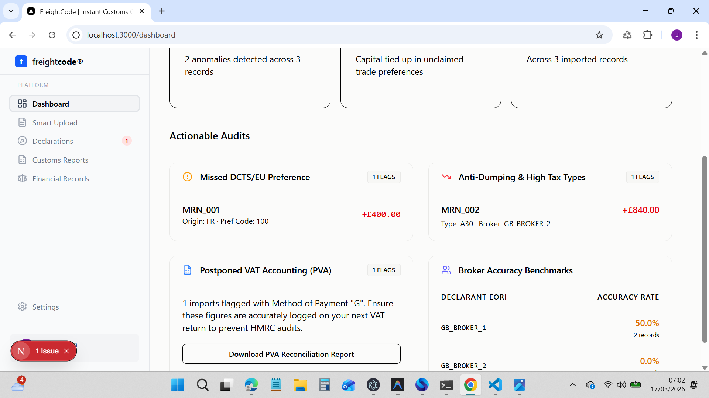

- [x] Explore project structure at `C:/Users/jason/trader-app` <!-- id: 0 -->
- [x] Read `.agents/rules.md` for context <!-- id: 1 -->
- [x] Analyze sidebar architecture and components <!-- id: 2 -->
- [x] Determine what the user wants to "add to root" <!-- id: 3 -->
- [x] UI Consolidation & Stability <!-- id: 27 -->
    - [x] Uninstall contaminated `radix-ui` library.
    - [x] Migrate all UI components to modular `@radix-ui/react-*` primitives.
    - [x] Fix runtime error by replacing `Slot.Root` with `Slot`.
    - [x] Purge unrequested "suppress" styles (Sidebar, Header).
    - [x] Remove HS suggested code logic from Lanes page.
- [ ] Unify Prospects in Workspace <!-- id: 34 -->
    - [/] Update implementation plan for Prospects wiring <!-- id: 35 -->
    - [ ] Remove MOCK_LEADS and wire to real leads system <!-- id: 36 -->
    - [ ] Add status management to Prospects tab <!-- id: 37 -->
- [ ] Final Build & Verification.

## Notes
- 2026-03-17: Actionable Audits cards on `/dashboard` had heavy black borders/dividers and mismatched rounding vs KPI cards. Fixed by setting `rounded-xl`, switching borders/dividers to `#e9e9e7`, using muted header background `#fbfbfa`, and softer hover `#f7f7f5`. Applied matching muted-header + light-border styling to `reports` and `records` pages. Files: `src/app/dashboard/page.tsx`, `src/app/dashboard/reports/page.tsx`, `src/app/dashboard/records/page.tsx`.
- 2026-03-17: Issue summary to fix: After a crash “today,” dashboard UI shows a mix of legacy Trade/Prospects pages and current customs‑declaration app. Sidebar contains legacy items and mismatched styling across sections. Observed pages: `/dashboard/admin`, `/dashboard/documents`, `/dashboard/records` (screenshots provided). Symptoms: inconsistent designs/features; sidebar includes legacy/irrelevant routes (e.g., Prospects, old assistant variants), suggesting multiple app versions surfaced together. Impact: confusing UX and broken IA; users see features not aligned with current customs‑declaration scope. Suspected cause: sidebar and routing not aligned to current product scope; legacy routes still present and linked.
